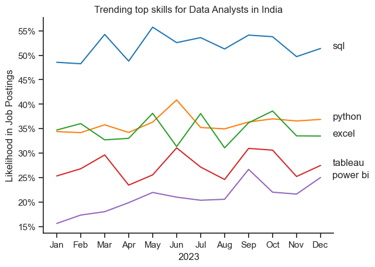

# The Analysis
## 1. What are the most in demand skills for the top 3 data roles in India?
To find the most in demand skills for the top 3 most popular data roles.
I filtered out those 3 positions which were most popular, and got the top 5 skills of these top 3 roles.
This query highlights the most popular job titles and their top skills, showing which skills I should pay attention to depending on the role I'm targetting.

View my notebook with detailed steps here:
[2_skills_count.ipynb]()

### Visualize Data
``` python

fig,ax = plt.subplots(len(job_titles),1)
sns.set_theme(style='ticks')
for i , job_title in enumerate(job_titles):
    df_plot = df_merge[df_merge['job_title_short'] == job_titles[i]].head(5)
    sns.barplot(data = df_plot,x='skill_perc',y='job_skills',ax= ax[i],hue = 'skill_count',palette='dark:b_r')
plt.show()
```
### Results


### Insights

* SQL is the most requested skill for Data Analysts and Data Scientists, with it in over half the job postings for both roles. For Data Engineers, Python is the most sought-after skill, appearing in 68% of job postings.
* Data Engineers require more specialized technical skills (AWS, Azure, Spark) compared to * Data Analysts and Data Scientists who are expected to be proficient in more general data management and analysis tools (Excel, Tableau).
* Python is a versatile skill, highly demanded across all three roles, but most prominently for Data Scientists (72%) and Data Engineers (65%).

## 2. How are in demand skills trending for Data Analysts in India

### Visualize Data
``` python
sns.lineplot(data=df_plot,dashes=False,palette='tab10')
sns.set_theme(style='ticks')
sns.despine()
plt.title('Trending top skills for Data Analysts in India')
plt.ylabel('Likelihood in Job Postings')
plt.xlabel('2023')
plt.legend().remove()
from matplotlib.ticker import PercentFormatter
ax = plt.gca()
ax.yaxis.set_major_formatter(PercentFormatter(decimals=0))
for i in range(5):
    plt.text(11.5,df_plot.iloc[-1,i],df_plot.columns[i])
```
### The results

*Line Graph Visualizing the top trending skills for Data Analysts in 2023.*

### Insights
* SQL remains the most consistently demanded skill throughout the year, although it shows a gradual decrease in demand.
* Excel experienced a significant increase in demand starting around September, surpassing both Python and Tableau by the end of the year.
* Both Python and Tableau show relatively stable demand throughout the year with some fluctuations but remain essential skills for data analysts.
* Power BI, while less demanded compared to the others, shows a slight upward trend towards the year's end.
