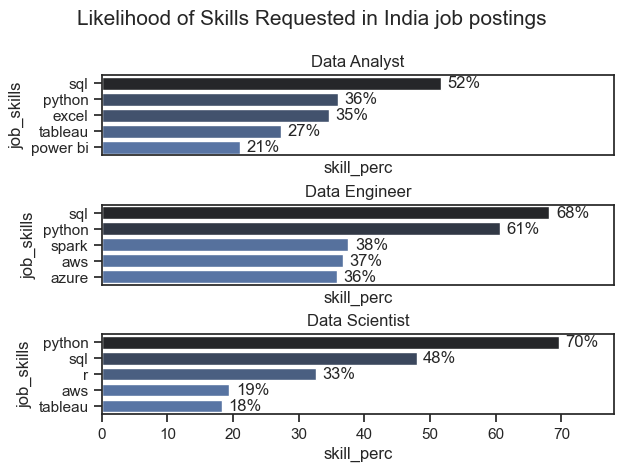

# The Analysis
## 1. What are the most in demand skills for the top 3 data roles in India?
To find the most in demand skills for the top 3 most popular data roles.
I filtered out those 3 positions which were most popular, and got the top 5 skills of these top 3 roles.
This query highlights the most popular job titles and their top skills, showing which skills I should pay attention to depending on the role I'm targetting.

View my notebook with detailed steps here:
[2_skills_count.ipynb]()

### Visualize Data
``` python

fig,ax = plt.subplots(len(job_titles),1)
sns.set_theme(style='ticks')
for i , job_title in enumerate(job_titles):
    df_plot = df_merge[df_merge['job_title_short'] == job_titles[i]].head(5)
    sns.barplot(data = df_plot,x='skill_perc',y='job_skills',ax= ax[i],hue = 'skill_count',palette='dark:b_r')
plt.show()
```
### Results


### Insights
