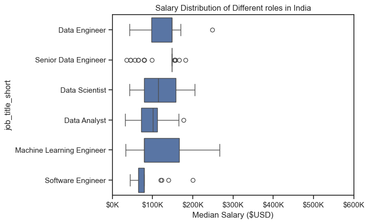

# Overview
Welcome to my analysis of the data job market, focusing on data analyst roles. This project was created out of a desire to navigate and understand the job market more effectively. It delves into the top-paying and in-demand skills to help find optimal job opportunities for data analysts.

The data sourced from [Luke Barousse's Python Course](https://youtu.be/wUSDVGivd-8?list=LL) which provides a foundation for my analysis, containing detailed information on job titles, salaries, locations, and essential skills. Through a series of Python scripts, I explore key questions such as the most demanded skills, salary trends, and the intersection of demand and salary in data analytics.

# The Questions
Below are the questions I want to answer in my project:

1. What are the skills most in demand for the top 3 most popular data roles?
2. How are in-demand skills trending for Data Analysts?
3. How well do jobs and skills pay for Data Analysts?
4. What are the optimal skills for data analysts to learn? (High Demand AND High Paying)

# Tools I used
For my deep dive into the data analyst job market, I harnessed the power of several key tools:

* #### Python:
 The backbone of my analysis, allowing me to analyze the data and find critical insights.I also used the following Python libraries:
* Pandas Library: This was used to analyze the data.
* Matplotlib Library: I visualized the data.
* Seaborn Library: Helped me create more advanced visuals.
* Jupyter Notebooks: The tool I used to run my Python scripts which let me easily include my notes and analysis.
* Visual Studio Code: My go-to for executing my Python scripts.
* Git & GitHub: Essential for version control and sharing my Python code and analysis, ensuring collaboration and project tracking.

# Data Preparation and Cleanup
This section outlines the steps taken to prepare the data for analysis, ensuring accuracy and usability.
## Import and Cleanup Data
I started by importing necessary libraries and loading the dataset, followed by initial data cleaning tasks to ensure data quality.
``` python
import ast
import pandas as pd 
from datasets import load_dataset
import seaborn as sns
import matplotlib.pyplot as plt

# Loading the Dataset
dataset = load_dataset('lukebarousse/data_jobs')
df = dataset['train'].to_pandas()
df['job_posted_date'] = pd.to_datetime(df['job_posted_date'])

# Data Cleanup
def clean_list(skill_list):
    if pd.notna(skill_list):
        return ast.literal_eval(skill_list)
    else:
        return
    
df['job_skills'] = df['job_skills'].apply(clean_list)
```

# The Analysis
## 1. What are the most in demand skills for the top 3 data roles in India?
To find the most in demand skills for the top 3 most popular data roles.
I filtered out those 3 positions which were most popular, and got the top 5 skills of these top 3 roles.
This query highlights the most popular job titles and their top skills, showing which skills I should pay attention to depending on the role I'm targetting.

View my notebook with detailed steps here:
[2_skills_count.ipynb]()

### Visualize Data
``` python

fig,ax = plt.subplots(len(job_titles),1)
sns.set_theme(style='ticks')
for i , job_title in enumerate(job_titles):
    df_plot = df_merge[df_merge['job_title_short'] == job_titles[i]].head(5)
    sns.barplot(data = df_plot,x='skill_perc',y='job_skills',ax= ax[i],hue = 'skill_count',palette='dark:b_r')
plt.show()
```
### Results


### Insights

* SQL is the most requested skill for Data Analysts and Data Scientists, with it in over half the job postings for both roles. For Data Engineers, Python is the most sought-after skill, appearing in 68% of job postings.
* Data Engineers require more specialized technical skills (AWS, Azure, Spark) compared to * Data Analysts and Data Scientists who are expected to be proficient in more general data management and analysis tools (Excel, Tableau).
* Python is a versatile skill, highly demanded across all three roles, but most prominently for Data Scientists (72%) and Data Engineers (65%).

## 2. How are in demand skills trending for Data Analysts in India

### Visualize Data
``` python
sns.lineplot(data=df_plot,dashes=False,palette='tab10')
sns.set_theme(style='ticks')
sns.despine()
plt.title('Trending top skills for Data Analysts in India')
plt.ylabel('Likelihood in Job Postings')
plt.xlabel('2023')
plt.legend().remove()
from matplotlib.ticker import PercentFormatter
ax = plt.gca()
ax.yaxis.set_major_formatter(PercentFormatter(decimals=0))
for i in range(5):
    plt.text(11.5,df_plot.iloc[-1,i],df_plot.columns[i])
```
### The results

*Line Graph Visualizing the top trending skills for Data Analysts in 2023.*

### Insights
* SQL remains the most consistently demanded skill throughout the year, although it shows a gradual decrease in demand.
* Excel experienced a significant increase in demand starting around September, surpassing both Python and Tableau by the end of the year.
* Both Python and Tableau show relatively stable demand throughout the year with some fluctuations but remain essential skills for data analysts.
* Power BI, while less demanded compared to the others, shows a slight upward trend towards the year's end.

## 3. How well do jobs and skills pay for Data Analysts
To identify the highest-paying roles and skills, I only got jobs in the United States and looked at their median salary. But first I looked at the salary distributions of common data jobs like Data Scientist, Data Engineer, and Data Analyst, to get an idea of which jobs are paid the most.
View my notebook with detailed steps here:
[4_Salary_Analysis](4_salary_analysis)


### Visualize Data
``` python
sns.boxplot(data=df_IND_top6,x='salary_year_avg',y='job_title_short',order=job_order)
sns.set_theme(style='ticks')
plt.xlim(0,600000)
ax = plt.gca()
ax.xaxis.set_major_formatter(plt.FuncFormatter(lambda x,_:f'${int(x/1000)}K'))
plt.title('Salary Distribution of Different roles in India')
plt.xlabel('Median Salary ($USD)')
```
### Results

*Box plot visualizing the salary distributions for the top 6 data job titles.*

### Insights
* There's a significant variation in salary ranges across different job titles. Senior Data Scientist positions tend to have the highest salary potential, with up to $600K, indicating the high value placed on advanced data skills and experience in the industry.

* Senior Data Engineer and Senior Data Scientist roles show a considerable number of outliers on the higher end of the salary spectrum, suggesting that exceptional skills or circumstances can lead to high pay in these roles. In contrast, Data Analyst roles demonstrate more consistency in salary, with fewer outliers.

* The median salaries increase with the seniority and specialization of the roles. Senior roles (Senior Data Scientist, Senior Data Engineer) not only have higher median salaries but also larger differences in typical salaries, reflecting greater variance in compensation as responsibilities increase.


## 4. Highest Paid & Most Demanded Skills for Data Analysts
To identify the highest-paying roles and skills, I only got jobs in the United States and looked at their median salary. But first I looked at the salary distributions of common data jobs like Data Scientist, Data Engineer, and Data Analyst, to get an idea of which jobs are paid the most.
View my notebook with detailed steps here:
[5_optimal_skills](4_optimal_skills)


### Visualize Data
``` python
df_DA_skills_high_demand.plot(kind='scatter',x='skill_percent',y= 'median_salary')

texts = []
for i,txt in enumerate(df_DA_skills_high_demand.index):
    texts.append(plt.text(df_DA_skills_high_demand['skill_percent'].iloc[i],df_DA_skills_high_demand['median_salary'].iloc[i],txt))

adjust_text(
    texts,
    arrowprops=dict(arrowstyle='->', color='gray', lw=0.5),
    expand_text=(1.2, 1.2),
    expand_points=(1.2, 1.2),
    force_text=(0.8, 2.0),
    force_points=(0.8, 2.0)
)
plt.show()
```
### Results

*A scatter plot visualizing the most optimal skills (high paying & high demand) for data analysts in India.*

### Insights
* The skills Looker,PowerPoint,Spark and Power BI appears to have the highest median salary of nearly $111K, despite being less common in job postings. This suggests a high value placed on specialized database skills within the data analyst profession.

* More commonly required skills like Excel,SQL and Python have a large presence in job listings but lower median salaries compared to Visualization skills like Power BI and Tableau.

## Visualizing Different Techonologies
Let's visualize the different technologies as well in the graph. We'll add color labels based on the technology (e.g., {Programming: Python})

### Visualize Data
``` python
sns.scatterplot(
    data=df_plot,
    x='skill_percent',
    y='median_salary',
    hue='technology',
    palette = 'bright'
)

sns.despine()
sns.set_theme(style='ticks')
plt.show()
```
### Results


*A scatter plot visualizing the most optimal skills (high paying & high demand) for data analysts in India with color labels for technology.*

### Insights
* SQL and Python Dominate: SQL and Python are among the most in-demand skills for data analysts in India, with high percentages of job requirements (around 50% and 40%, respectively). They also offer relatively high median yearly salaries.

* Power BI and Tableau: These analyst tools are popular, appearing in about 25–30% of job postings. They are associated with competitive salaries ranging from $95K to $110K.

* Cloud and Other Libraries: Cloud technologies like Azure and AWS are less commonly required (10–20% of jobs) but still command good salaries. Similarly, libraries like Spark are associated with higher pay despite lower demand.

# What I Learned
#### Throughout this project, I deepened my understanding of the data analyst job market and enhanced my technical skills in Python, especially in data manipulation and visualization. Here are a few specific things I learned:

* ### Advanced Python Usage:
 Utilizing libraries such as Pandas for data manipulation, Seaborn and Matplotlib for data visualization, and other libraries helped me perform complex data analysis tasks more efficiently.

* ### Data Cleaning Importance:
 I learned that thorough data cleaning and preparation are crucial before any analysis can be conducted, ensuring the accuracy of insights derived from the data.

* ### Strategic Skill Analysis:
 The project emphasized the importance of aligning one's skills with market demand. Understanding the relationship between skill demand, salary, and job availability allows for more strategic career planning in the tech industry.

# Insights
#### This project provided several general insights into the data job market for analysts:

* ### Skill Demand and Salary Correlation:
 There is a clear correlation between the demand for specific skills and the salaries these skills command. Visualization tools like Tableau and Looker often lead to higher salaries.

* ### Market Trends:
 There are changing trends in skill demand, highlighting the dynamic nature of the data job market. Keeping up with these trends is essential for career growth in data analytics.

* ### Economic Value of Skills: 
Understanding which skills are both in-demand and well-compensated can guide data analysts in prioritizing learning to maximize their economic returns.

# Challenges I Faced
#### This project was not without its challenges, but it provided good learning opportunities:

* ### Data Inconsistencies:
 Handling missing or inconsistent data entries requires careful consideration and thorough data-cleaning techniques to ensure the integrity of the analysis.
* ### Complex Data Visualization: 
Designing effective visual representations of complex datasets was challenging but critical for conveying insights clearly and compellingly.
* ### Balancing Breadth and Depth:
 Deciding how deeply to dive into each analysis while maintaining a broad overview of the data landscape required constant balancing to ensure comprehensive coverage without getting lost in details.

# Conclusion
This exploration into the data analyst job market has been incredibly informative, highlighting the critical skills and trends that shape this evolving field. The insights I got enhance my understanding and provide actionable guidance for anyone looking to advance their career in data analytics. As the market continues to change, ongoing analysis will be essential to stay ahead in data analytics. This project is a good foundation for future explorations and underscores the importance of continuous learning and adaptation in the data field.